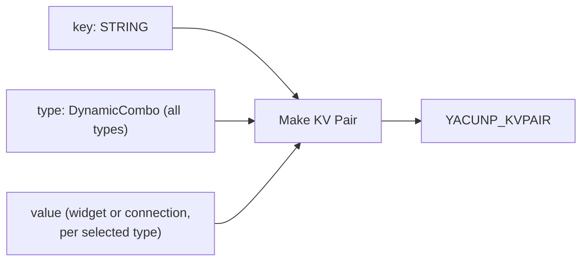
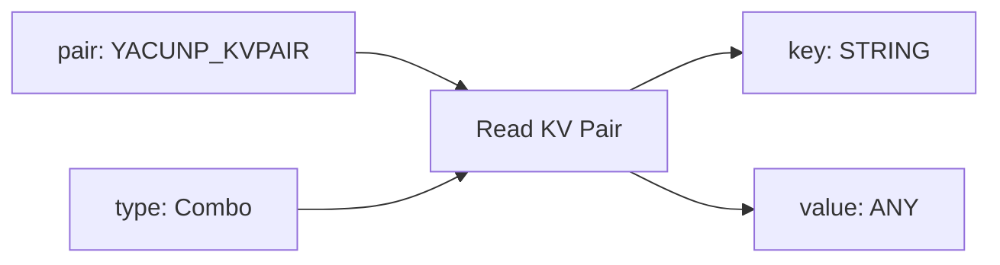
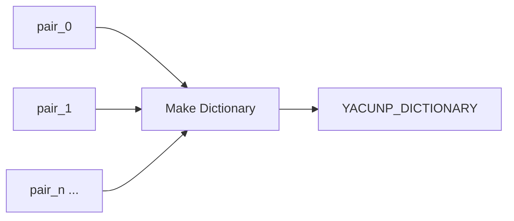
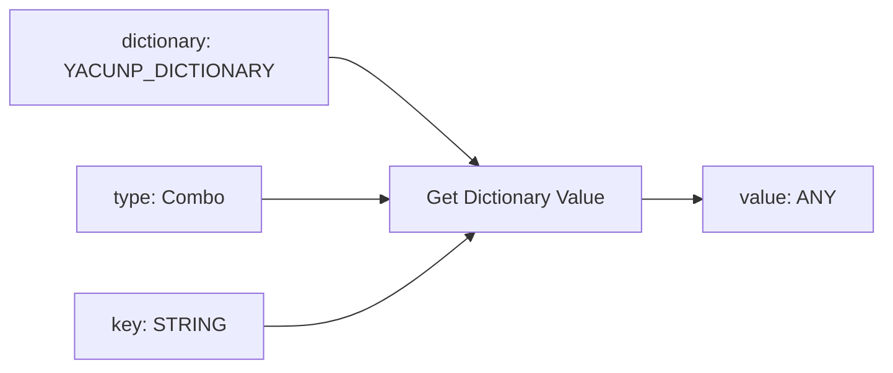
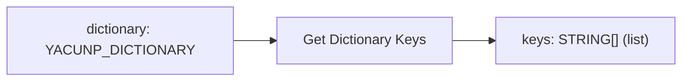
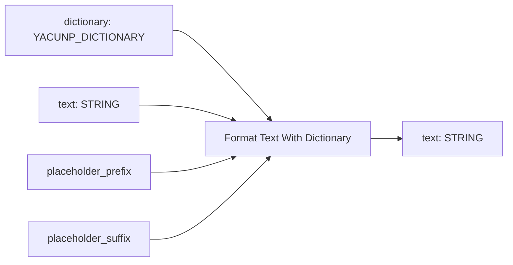
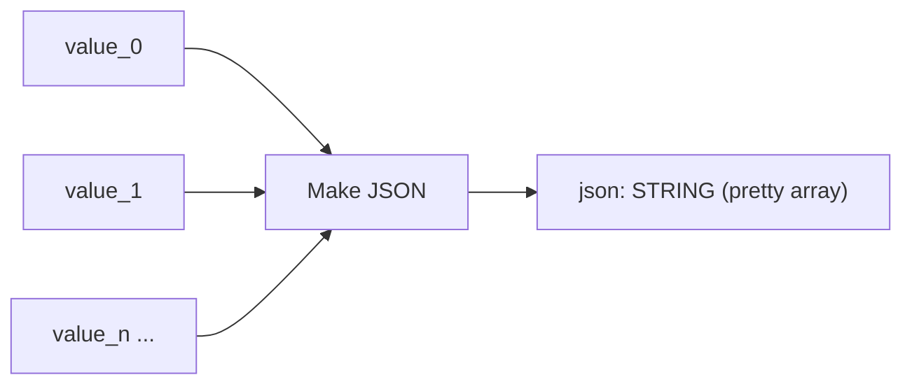
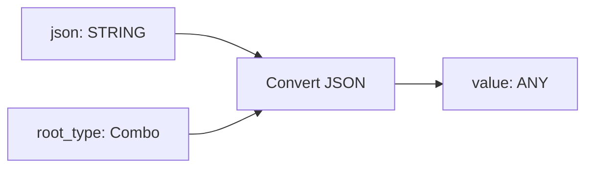
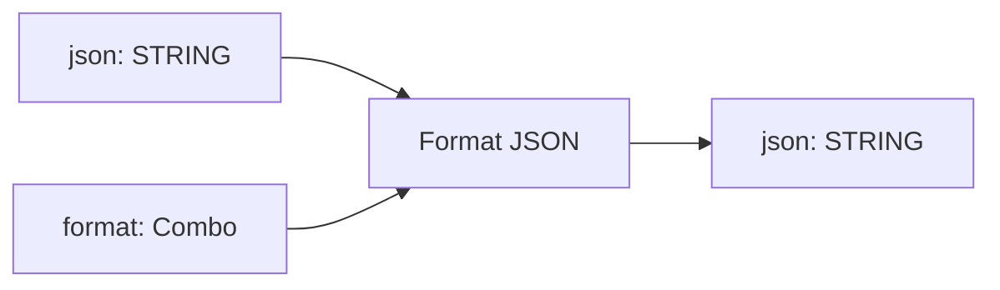

# YACUNP node list

The full catalog of YACUNP nodes, grouped by category. Each entry lists the
node's purpose, inputs, outputs, error conditions, and a diagram of its data
flow.

> Screenshots and downloadable sample workflows will be added in a later
> revision.

## Shared concepts

- **KV Pair** (`YACUNP_KVPAIR`) — a single key plus a value that remembers the
  ComfyUI **declared type** it was created with (e.g. `STRING`, `INT`, `IMAGE`).
- **Dictionary** (`YACUNP_DICTIONARY`) — an ordered collection of KV pairs keyed
  by their key string.
- **Type registry** — one shared table lists every supported ComfyUI type and
  defines how each type is entered (widget vs. connection), serialized to JSON,
  and stringified. Scalar types (`STRING`, `INT`, `FLOAT`, `BOOLEAN`) use manual
  widgets; container types recurse; tensor-backed / opaque types (`IMAGE`,
  `LATENT`, `MODEL`, …) serialize to a **descriptor** dict of the form
  `{"__type__": "IMAGE", "shape": [...], "dtype": "..."}`.
- **Type checking** — nodes that read a typed value verify the requested type
  matches the stored declared type. `ANY` matches every type.

---

## Category: `YACUNP/Dictionary`

### Make KV Pair — `YACUNP_MakeKVPair`

**Purpose:** Build a typed key/value pair. Selecting a type in the `type`
dropdown reveals the matching value slot — a manual widget for scalar types, or a
connection-only input for everything else.

| Direction | Name | Type | Notes |
|---|---|---|---|
| Input | `key` | `STRING` | The pair's key (connectable). |
| Input | `type` | Dynamic combo | All registry types; selection exposes a `value` sub-input. |
| Output | `kvpair` | `YACUNP_KVPAIR` | The assembled pair. |

**Errors:** none at runtime (an unknown type cannot be selected).

### Read KV Pair — `YACUNP_ReadKVPair`

**Purpose:** Split a KV pair back into its key and value. The selected `type`
must match the pair's declared type.

| Direction | Name | Type | Notes |
|---|---|---|---|
| Input | `pair` | `YACUNP_KVPAIR` | The pair to read. |
| Input | `type` | Combo | Expected declared type (all registry types). |
| Output | `key` | `STRING` | The pair's key. |
| Output | `value` | `ANY` | The pair's value (widget-chosen type → `*`). |

**Errors:** raises if `pair.declared_type` does not match `type` (unless either
side is `ANY`).

### Make Dictionary — `YACUNP_MakeDictionary`

**Purpose:** Combine one or more KV pairs into an ordered dictionary. The input
grows extra slots as pairs are connected, and a slot may also carry a list of
pairs.

| Direction | Name | Type | Notes |
|---|---|---|---|
| Input | `pairs` | Autogrow of `YACUNP_KVPAIR` | One pair (or a list of pairs) per slot. |
| Output | `dictionary` | `YACUNP_DICTIONARY` | Ordered dictionary. |

**Errors:** raises on a duplicate key, or if a slot carries a value that is not a
KV pair.

### Get Dictionary Value — `YACUNP_GetDictionaryValue`

**Purpose:** Look up a single value in a dictionary by key.

| Direction | Name | Type | Notes |
|---|---|---|---|
| Input | `dictionary` | `YACUNP_DICTIONARY` | The dictionary to query. |
| Input | `type` | Combo | Expected declared type of the value. |
| Input | `key` | `STRING` | Key to look up. |
| Output | `value` | `ANY` | The stored value. |

**Errors:** raises if the key is missing, or if the stored declared type does not
match `type` (unless either side is `ANY`).

### Get Dictionary Keys — `YACUNP_GetDictionaryKeys`

**Purpose:** Output the ordered list of keys in a dictionary.

| Direction | Name | Type | Notes |
|---|---|---|---|
| Input | `dictionary` | `YACUNP_DICTIONARY` | The dictionary to inspect. |
| Output | `keys` | `STRING` (list) | Ordered keys, as a list output. |

**Errors:** none.

### Format Text With Dictionary — `YACUNP_FormatTextWithDictionary`

**Purpose:** Replace `{key}` placeholders in a text template with the string form
of each dictionary value. The delimiters are configurable.

| Direction | Name | Type | Notes |
|---|---|---|---|
| Input | `dictionary` | `YACUNP_DICTIONARY` | Source of substitution values. |
| Input | `text` | `STRING` (multiline) | Template text. |
| Input | `placeholder_prefix` | `STRING` | Default `{`. |
| Input | `placeholder_suffix` | `STRING` | Default `}`. |
| Output | `text` | `STRING` | Text with placeholders substituted. |

**Errors:** none. Unknown placeholders are left untouched; each value is
stringified via the type registry (`to_text`).

---

## Category: `YACUNP/JSON`

### Make JSON — `YACUNP_MakeJSON`

**Purpose:** Encode any connected values into a pretty-printed JSON **array**.
KV pairs and dictionaries are serialized structurally; tensor-backed values
become descriptor dicts.

| Direction | Name | Type | Notes |
|---|---|---|---|
| Input | `values` | Autogrow of `ANY` | One value per slot; `None` slots are skipped. |
| Output | `json` | `STRING` | Pretty-printed JSON array. |

**Errors:** none (any value is best-effort serializable via the registry).

### Convert JSON — `YACUNP_ConvertJSON`

**Purpose:** Parse a JSON string into a nested Python value, validating the
top-level type against the selected root type.

| Direction | Name | Type | Notes |
|---|---|---|---|
| Input | `json` | `STRING` (multiline) | JSON text to parse. |
| Input | `root_type` | Combo | `any`, `list`, `dictionary`, `string`, `int`, `float`, `boolean`. |
| Output | `value` | `ANY` | Deeply nested parsed value. |

**Errors:** raises on invalid JSON, or when the decoded root does not match the
selected `root_type` (`any` accepts anything).

### Format JSON — `YACUNP_FormatJSON`

**Purpose:** Re-serialize a JSON string as either a single line or pretty-printed
text.

| Direction | Name | Type | Notes |
|---|---|---|---|
| Input | `json` | `STRING` (multiline) | JSON text to reformat. |
| Input | `format` | Combo | `single_line` or `pretty`. |
| Output | `json` | `STRING` | Reformatted JSON. |

**Errors:** raises on invalid JSON input.

