# YACUNP node list

The full catalog of YACUNP nodes, grouped by category. Each entry lists the
node's purpose, inputs, outputs, error conditions, and a diagram of its data
flow.

> Screenshots and downloadable sample workflows will be added in a later
> revision.

## Shared concepts

- **KV Pair** (`YACUNP_KVPAIR`) — a single key plus a value that remembers the
  ComfyUI **declared type** it was created with (e.g. `STRING`, `INT`, `IMAGE`).
- **Dictionary** (`YACUNP_DICTIONARY`) — an ordered collection of KV pairs keyed
  by their key string.
- **Type registry** — one shared table lists every supported ComfyUI type and
  defines how each type is entered (widget vs. connection), serialized to JSON,
  and stringified. Scalar types (`STRING`, `INT`, `FLOAT`, `BOOLEAN`) use manual
  widgets; container types recurse; tensor-backed / opaque types (`IMAGE`,
  `LATENT`, `MODEL`, …) serialize to a **descriptor** dict of the form
  `{"__type__": "IMAGE", "shape": [...], "dtype": "..."}`.
- **Type checking** — nodes that read a typed value verify the requested type
  matches the stored declared type. `ANY` matches every type.
- **LLM model** (`YACUNP_LLM_MODEL`) — an opaque handle to a loaded local model
  (a live `llama_cpp.Llama` instance or an LM Studio client descriptor). It is
  passed between Local LLM nodes and is never serialized.
- **Arguments / info dictionaries** — Local LLM nodes exchange their parameters
  and diagnostics as ordinary `YACUNP_DICTIONARY` values, so any Dictionary node
  can build, inspect, or combine them.

---

## Category: `YACUNP/Dictionary`

### Make KV Pair — `YACUNP_MakeKVPair`

**Purpose:** Build a typed key/value pair. Selecting a type in the `type`
dropdown reveals the matching value slot — a manual widget for scalar types, or a
connection-only input for everything else.

| Direction | Name | Type | Notes |
|---|---|---|---|
| Input | `key` | `STRING` | The pair's key (connectable). |
| Input | `type` | Dynamic combo | All registry types; selection exposes a `value` sub-input. |
| Output | `kvpair` | `YACUNP_KVPAIR` | The assembled pair. |

**Errors:** none at runtime (an unknown type cannot be selected).

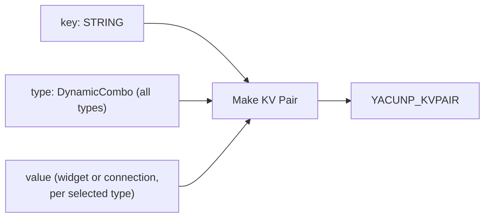

### Read KV Pair — `YACUNP_ReadKVPair`

**Purpose:** Split a KV pair back into its key and value. The selected `type`
must match the pair's declared type.

| Direction | Name | Type | Notes |
|---|---|---|---|
| Input | `pair` | `YACUNP_KVPAIR` | The pair to read. |
| Input | `type` | Combo | Expected declared type (all registry types). |
| Output | `key` | `STRING` | The pair's key. |
| Output | `value` | `ANY` | The pair's value (widget-chosen type → `*`). |

**Errors:** raises if `pair.declared_type` does not match `type` (unless either
side is `ANY`).

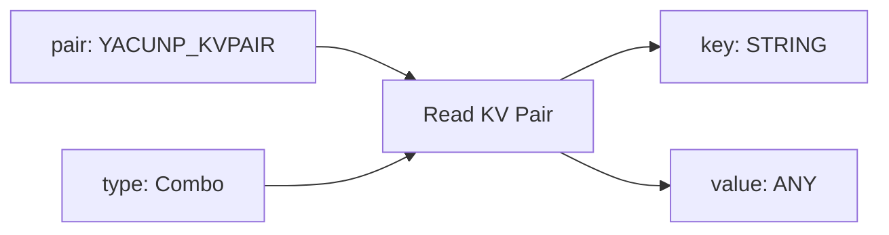

### Make Dictionary — `YACUNP_MakeDictionary`

**Purpose:** Combine one or more KV pairs into an ordered dictionary. The input
grows extra slots as pairs are connected, and a slot may also carry a list of
pairs.

| Direction | Name | Type | Notes |
|---|---|---|---|
| Input | `pairs` | Autogrow of `YACUNP_KVPAIR` | One pair (or a list of pairs) per slot. |
| Output | `dictionary` | `YACUNP_DICTIONARY` | Ordered dictionary. |

**Errors:** raises on a duplicate key, or if a slot carries a value that is not a
KV pair.

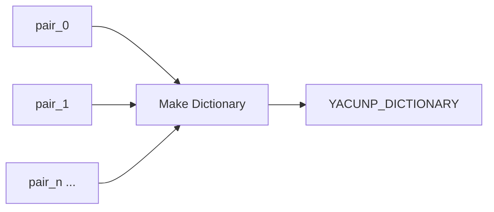

### Get Dictionary Value — `YACUNP_GetDictionaryValue`

**Purpose:** Look up a single value in a dictionary by key.

| Direction | Name | Type | Notes |
|---|---|---|---|
| Input | `dictionary` | `YACUNP_DICTIONARY` | The dictionary to query. |
| Input | `type` | Combo | Expected declared type of the value. |
| Input | `key` | `STRING` | Key to look up. |
| Output | `value` | `ANY` | The stored value. |

**Errors:** raises if the key is missing, or if the stored declared type does not
match `type` (unless either side is `ANY`).

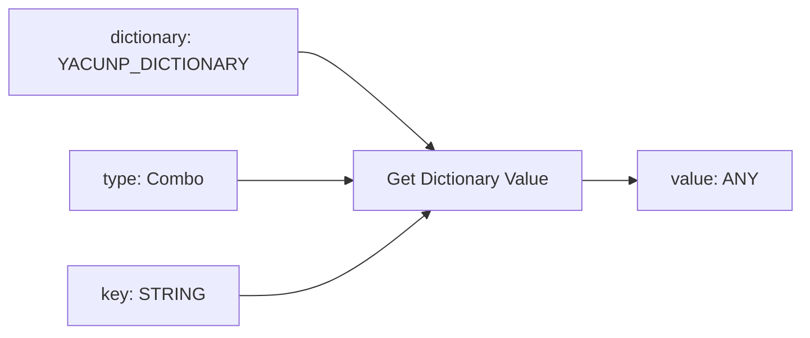

### Get Dictionary Keys — `YACUNP_GetDictionaryKeys`

**Purpose:** Output the ordered list of keys in a dictionary.

| Direction | Name | Type | Notes |
|---|---|---|---|
| Input | `dictionary` | `YACUNP_DICTIONARY` | The dictionary to inspect. |
| Output | `keys` | `STRING` (list) | Ordered keys, as a list output. |

**Errors:** none.

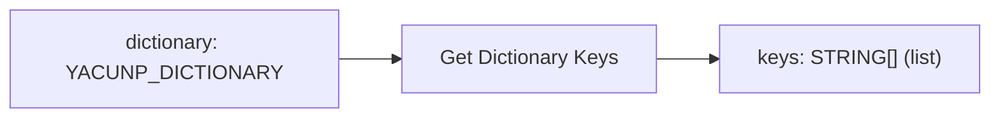

### Format Text With Dictionary — `YACUNP_FormatTextWithDictionary`

**Purpose:** Replace `{key}` placeholders in a text template with the string form
of each dictionary value. The delimiters are configurable.

| Direction | Name | Type | Notes |
|---|---|---|---|
| Input | `dictionary` | `YACUNP_DICTIONARY` | Source of substitution values. |
| Input | `text` | `STRING` (multiline) | Template text. |
| Input | `placeholder_prefix` | `STRING` | Default `{`. |
| Input | `placeholder_suffix` | `STRING` | Default `}`. |
| Output | `text` | `STRING` | Text with placeholders substituted. |

**Errors:** none. Unknown placeholders are left untouched; each value is
stringified via the type registry (`to_text`).

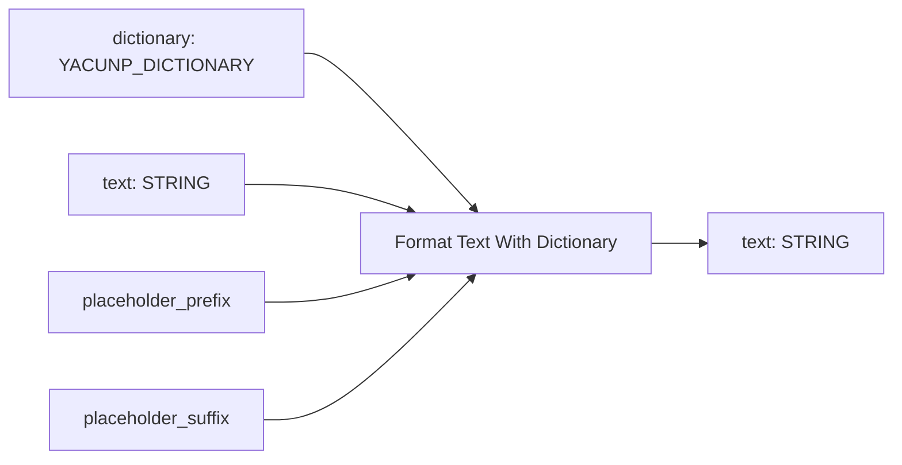

### Set Dictionary Value — `YACUNP_SetDictionaryValue`

**Purpose:** Insert or update one KV pair in a dictionary, returning a new
dictionary (the input is not mutated).

| Direction | Name | Type | Notes |
|---|---|---|---|
| Input | `dictionary` | `YACUNP_DICTIONARY` | Source dictionary. |
| Input | `pair` | `YACUNP_KVPAIR` | Pair to set. |
| Input | `on_conflict` | Combo | `replace` (default) or `throw_error`. |
| Output | `dictionary` | `YACUNP_DICTIONARY` | Dictionary with the pair set. |

**Errors:** raises when the key already exists and `on_conflict` is
`throw_error`, or when `pair` is not a KV pair.

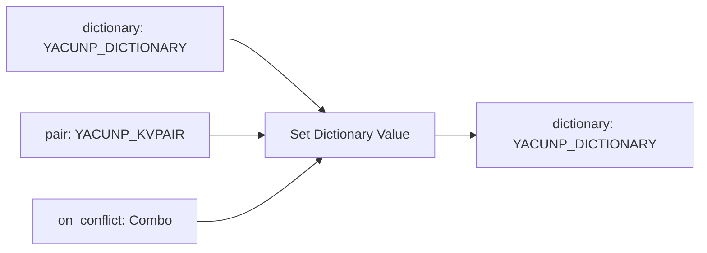

### Combine Dictionaries — `YACUNP_CombineDictionaries`

**Purpose:** Merge two or more dictionaries into one. The `collision_mode`
decides what happens when a key appears more than once.

| Direction | Name | Type | Notes |
|---|---|---|---|
| Input | `dictionaries` | Autogrow of `YACUNP_DICTIONARY` | Two or more dictionaries. |
| Input | `collision_mode` | Combo | `throw_error`, `keep_first`, `keep_last`, `concatenate`, `list_combine_values`. |
| Input | `separator` | `STRING` | Joiner for `concatenate` (default a space). |
| Output | `dictionary` | `YACUNP_DICTIONARY` | Merged dictionary. |

**Errors:** raises on a duplicate key when `collision_mode` is `throw_error`, or
if a slot carries a value that is not a dictionary. `concatenate` produces a
`STRING` value; `list_combine_values` produces an `ARRAY` value.

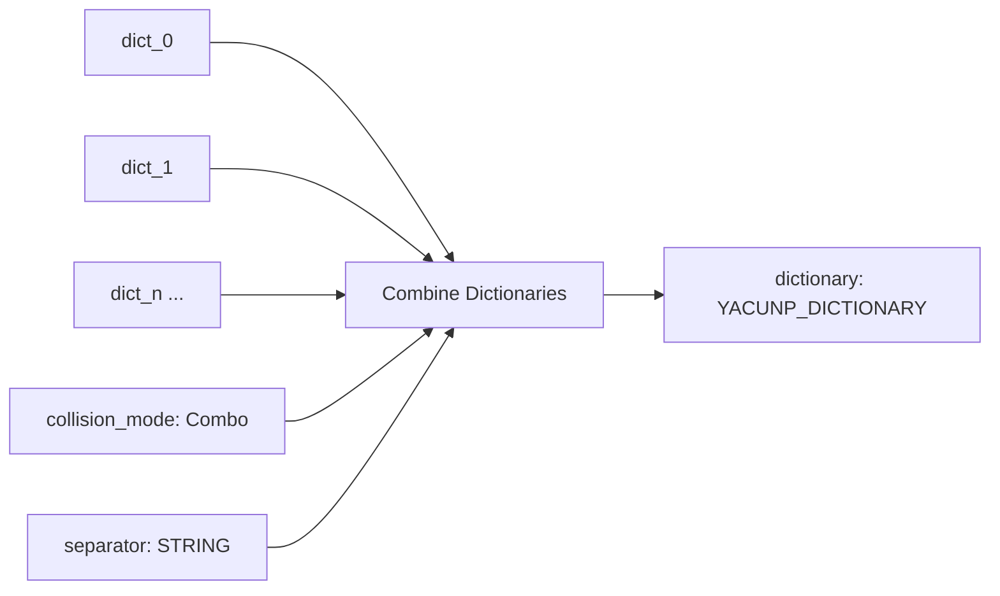

---

## Category: `YACUNP/JSON`

### Make JSON — `YACUNP_MakeJSON`

**Purpose:** Encode any connected values into a pretty-printed JSON **array**.
KV pairs and dictionaries are serialized structurally; tensor-backed values
become descriptor dicts.

| Direction | Name | Type | Notes |
|---|---|---|---|
| Input | `values` | Autogrow of `ANY` | One value per slot; `None` slots are skipped. |
| Output | `json` | `STRING` | Pretty-printed JSON array. |

**Errors:** none (any value is best-effort serializable via the registry).

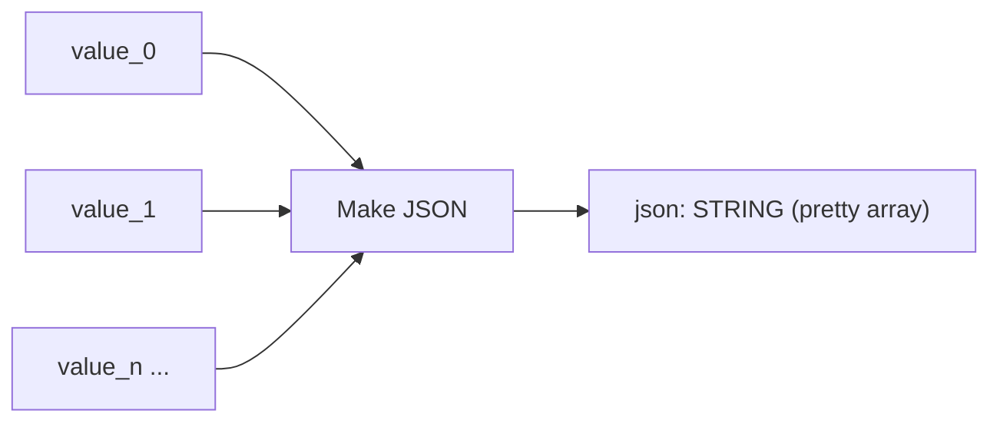

### Convert JSON — `YACUNP_ConvertJSON`

**Purpose:** Parse a JSON string into a nested Python value, validating the
top-level type against the selected root type.

| Direction | Name | Type | Notes |
|---|---|---|---|
| Input | `json` | `STRING` (multiline) | JSON text to parse. |
| Input | `root_type` | Combo | `any`, `list`, `dictionary`, `string`, `int`, `float`, `boolean`. |
| Output | `value` | `ANY` | Deeply nested parsed value. |

**Errors:** raises on invalid JSON, or when the decoded root does not match the
selected `root_type` (`any` accepts anything).

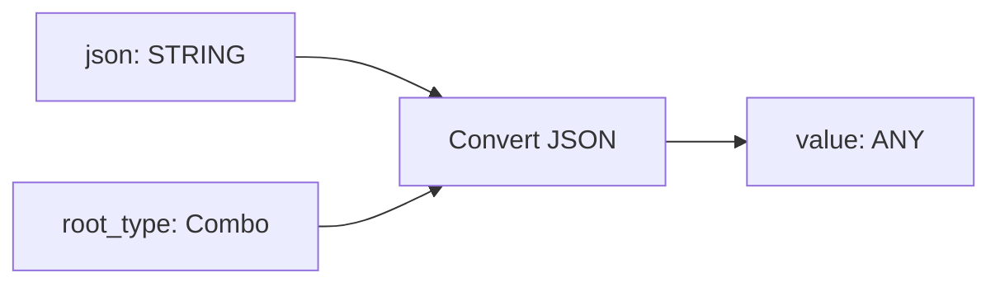

### Format JSON — `YACUNP_FormatJSON`

**Purpose:** Re-serialize a JSON string as either a single line or pretty-printed
text.

| Direction | Name | Type | Notes |
|---|---|---|---|
| Input | `json` | `STRING` (multiline) | JSON text to reformat. |
| Input | `format` | Combo | `single_line` or `pretty`. |
| Output | `json` | `STRING` | Reformatted JSON. |

**Errors:** raises on invalid JSON input.

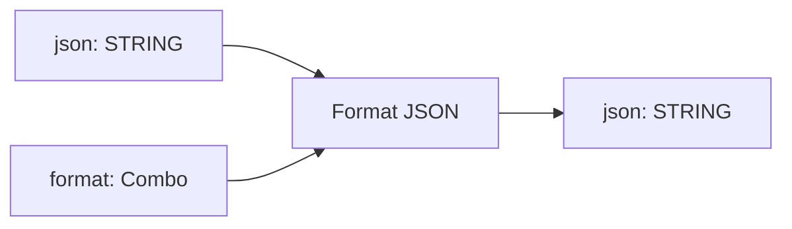

---

## Category: `YACUNP/Local LLM`

Nodes for running **local** LLMs (text and multimodal) from within a workflow.
They work only with models you already have on disk (llama.cpp / GGUF) or that a
running LM Studio server already exposes — **no model is ever downloaded**.
Models are declared in `local_models.json` (copy `local_models.example.json` to
start). Backends are imported lazily, so the pack loads even without
`llama-cpp-python` installed; a clear error is raised only when a node actually
runs.

Typical wiring: build an argument dictionary → **Load Model** (outputs the model
and its resolved arguments) → **Generate Text** (with an optional system prompt
and images) → optionally **Unload Model**.

### Make Basic LLM Arguments — `YACUNP_MakeBasicLLMArguments`

**Purpose:** Build a dictionary of the parameters people tune most often, each
with an explanatory tooltip.

| Direction | Name | Type | Notes |
|---|---|---|---|
| Input | `max_tokens` | `INT` | Max new tokens to generate (generation-time). |
| Input | `temperature` | `FLOAT` | Sampling randomness (generation-time). |
| Input | `top_p` | `FLOAT` | Nucleus sampling cutoff (generation-time). |
| Input | `seed` | `INT` | Sampling seed; 0 = fresh each run (generation-time). |
| Input | `n_ctx` | `INT` | Context window size (load-time). |
| Input | `n_gpu_layers` | `INT` | Layers to offload to GPU (load-time). |
| Output | `arguments` | `YACUNP_DICTIONARY` | The assembled arguments. |

**Errors:** none.

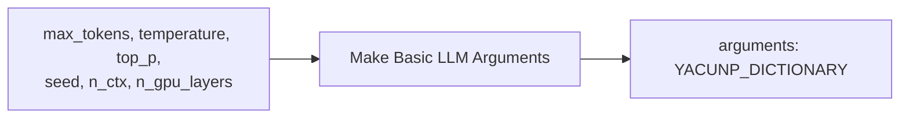

### Make Advanced LLM Arguments — `YACUNP_MakeAdvancedLLMArguments`

**Purpose:** Build a dictionary of the less common knobs, each with an
explanatory tooltip.

| Direction | Name | Type | Notes |
|---|---|---|---|
| Input | `top_k` | `INT` | Top-K sampling (generation-time). |
| Input | `min_p` | `FLOAT` | Minimum-probability cutoff (generation-time). |
| Input | `repeat_penalty` | `FLOAT` | Repetition penalty (generation-time). |
| Input | `presence_penalty` | `FLOAT` | Presence penalty (generation-time). |
| Input | `frequency_penalty` | `FLOAT` | Frequency penalty (generation-time). |
| Input | `n_batch` | `INT` | Prompt batch size (load-time). |
| Input | `n_threads` | `INT` | CPU threads (load-time). |
| Input | `flash_attn` | `BOOLEAN` | Enable FlashAttention (load-time). |
| Input | `image_max_tokens` | `INT` | Per-image token budget for mmproj (load-time). |
| Input | `stop` | `STRING` | Optional stop sequence (generation-time). |
| Output | `arguments` | `YACUNP_DICTIONARY` | The assembled arguments. |

**Errors:** none. Combine with Basic arguments via **Combine Dictionaries**.

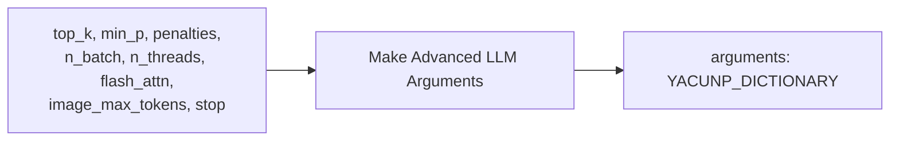

### Load Model (llama.cpp) — `YACUNP_LoadModelLlamaCpp`

**Purpose:** Load a local GGUF model with llama.cpp. Reads load-time keys from
the (optional) arguments dictionary, overlaid on the config defaults, and reads
known values (such as `n_ctx`) back from the loaded model.

| Direction | Name | Type | Notes |
|---|---|---|---|
| Input | `model` | Combo | Model keys from `local_models.json` (backend `llama_cpp`). |
| Input | `arguments` | `YACUNP_DICTIONARY` | Optional overrides (load-time keys used). |
| Output | `model` | `YACUNP_LLM_MODEL` | The loaded model handle. |
| Output | `resolved_arguments` | `YACUNP_DICTIONARY` | Config defaults + overrides + read-back values. |

**Errors:** raises if the model is not in the config, the file is missing, or
`llama-cpp-python` is not installed.

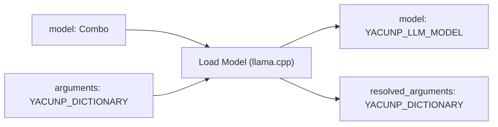

### Load Model (LM Studio) — `YACUNP_LoadModelLMStudio`

**Purpose:** Point at a running LM Studio server (OpenAI-compatible local API)
and select a model it already exposes. Uses only the standard library.

| Direction | Name | Type | Notes |
|---|---|---|---|
| Input | `base_url` | `STRING` | e.g. `http://localhost:1234/v1`. |
| Input | `model` | `STRING` | Model id from `GET /v1/models`; blank = first available. |
| Input | `multimodal` | `BOOLEAN` | Enable if the model accepts images. |
| Input | `arguments` | `YACUNP_DICTIONARY` | Optional overrides. |
| Output | `model` | `YACUNP_LLM_MODEL` | The model handle. |
| Output | `resolved_arguments` | `YACUNP_DICTIONARY` | Supplied overrides. |

**Errors:** raises if the server is unreachable, or if `model` is blank and the
server reports no models.

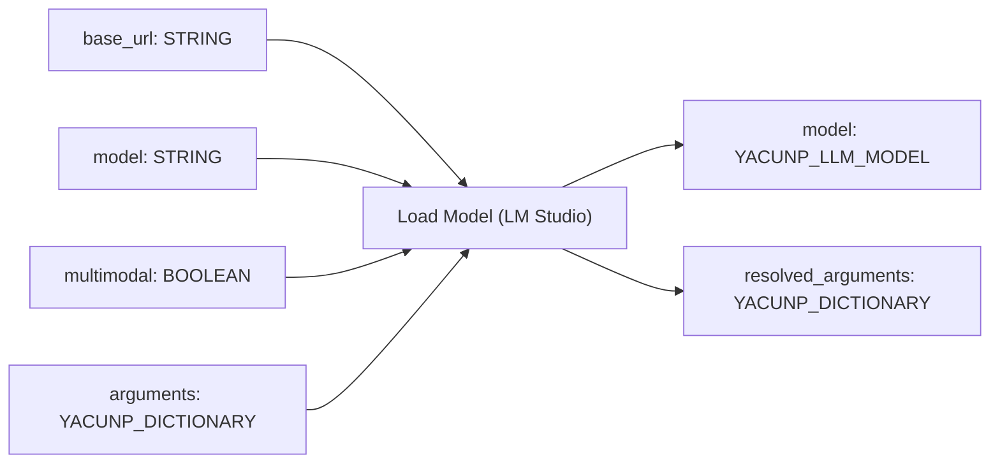

### System Prompt Presets — `YACUNP_SystemPromptPresets`

**Purpose:** Pick a ready-made system prompt grouped by purpose, optionally
append extra instructions, or replace it entirely with a custom override.

| Direction | Name | Type | Notes |
|---|---|---|---|
| Input | `preset` | Combo | `Category :: Preset` options; extend via `system_prompts.json`. |
| Input | `extra_instructions` | `STRING` (multiline) | Appended after the preset. |
| Input | `custom_override` | `STRING` (multiline) | If non-empty, replaces the preset. |
| Output | `system_prompt` | `STRING` | The resolved system prompt. |

**Errors:** raises on an unknown preset option.

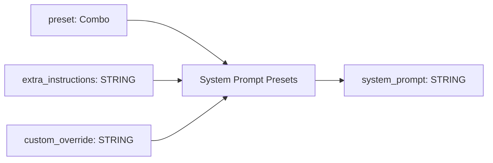

### Generate Text — `YACUNP_GenerateText`

**Purpose:** Run text generation on a loaded model (llama.cpp or LM Studio),
dispatching on the model's backend. Optional images enable multimodal models.

| Direction | Name | Type | Notes |
|---|---|---|---|
| Input | `model` | `YACUNP_LLM_MODEL` | The loaded model. |
| Input | `prompt` | `STRING` (multiline) | The user prompt. |
| Input | `system_prompt` | `STRING` (multiline) | Optional system prompt. |
| Input | `arguments` | `YACUNP_DICTIONARY` | Optional; generation-time keys are used. |
| Input | `image` | `IMAGE` | Optional image(s) for vision models. |
| Input | `image2` | `IMAGE` | Optional second image / batch. |
| Output | `text` | `STRING` | The generated text. |
| Output | `info` | `YACUNP_DICTIONARY` | Diagnostics (backend, model, token counts, …). |

**Errors:** raises if images are provided to a non-multimodal model, or if the
backend/model is unavailable.

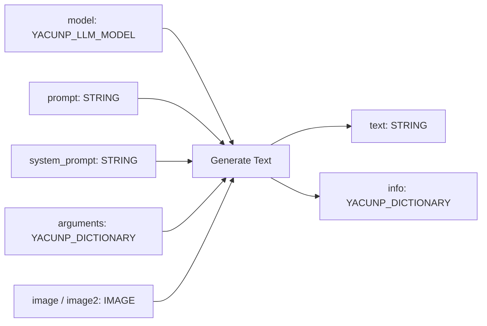

### Unload Model / VRAM Cleanup — `YACUNP_UnloadModel`

**Purpose:** Free a loaded model and run a VRAM/RAM cleanup pass (garbage
collection and, when available, a CUDA cache clear). Runs as an output node.

| Direction | Name | Type | Notes |
|---|---|---|---|
| Input | `model` | `YACUNP_LLM_MODEL` | Optional; model to unload. |
| Input | `signal` | `ANY` | Optional; connect to sequence this after generation. |
| Output | `info` | `YACUNP_DICTIONARY` | Cleanup diagnostics. |

**Errors:** none in normal operation.

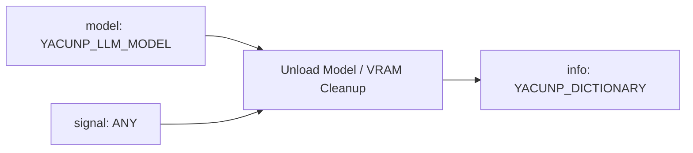

